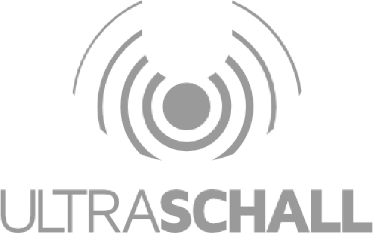

> 

# Transkription in Reaper - eine Bestandsaufnahme

Im Laufe der letzten paar Jahre hab ich immer wieder mich mal in die
Frage reingenerdet „wie würde man Transkription in Reaper abbilden
können“.

Im folgenden Dokument hab ich eine kleine Bestandsaufnahme gemacht, wie
man es umsetzen könnte und darüber hinaus, was dadurch möglich würde,
bzw was (derzeit noch?) nicht möglich ist.

Ich hab die Bestandsaufnahme in die einzelnen Schritte unterteilt, die
für ne Transkription erforderlich sind, als da wären, die Erstellung des
Transkripts, das Importieren der Transkripte in weiter verarbeitbare
Formen, das Bearbeiten der Transkripte, das Exportieren des fertig
geschnittenen Podcasts als Transkript sowie ein paar nice Features, die
dadurch möglich werden.

Einige der Schritte haben mehrere Entwicklungsbranches, die man begehen
könnte, Andere wiederum nur einen.

Ich vermute, dass einige der Sachen auch in Ralfs Prototypen bereits zum
Einsatz kommen, Anderes wiederum muss erst noch entwickelt werden, weil
es nicht ganz trivial umzusetzen ist.

tl;dr

Transkription ist vollständig umsetzbar, inklusive Schnitt und
wortgenauer Transkripte die wiedergeben, was im fertig geschnittenen
Projekt an Wortlaut vorhanden ist.

Ein Transkripteditor(vulgo „Edit via Text“) ist derzeit nicht baubar mit
Reapers Möglichkeiten. Sollte sowas aber machbar sein, so bietet meine
Bestandsaufnahme die Grundlagen die notwendig sind, um einen solchen
noch nachzurüsten, ohne dafür die bereits bestehende Infrastruktur(die
ich hier skizziert habe) umbauen zu müssen. aka: Ultraschall 6 Projekte
mit Transkription könnten in z.B. einer „Ultraschall 7“-Version mit
Transkripteditor ohne Anpassungen geschnitten werden.

Meo-Ada Mespotine

# Erstellung des Transkripts

> \|---\> während Export
>
> \|---\> per VST(Echtzeit Transkription während Aufnahme) \|---\> nach
> Aufnahme/vorm Schnitt

<u>Während Export:</u>

> Das Audio wird beim Exportvorgang als Einzelspuren exportiert und per
> Commandline durch Whisper geschickt und so WebVTTs erstellt. Dann wird
> das finale Audio als Mixdown gerendert und dort das WebVTT als
> Metadata mit ins MP3 gepackt.
>
> positive side(+):

- lässt sich sehr leicht in den Exportworkflow integrieren

- man transkribiert nur, was am Ende im geschnittenen Podcast landet(=
  ist schneller)

- geht per Whisper in CommandLine

- kein aufwändiges TakeMarker Management

> negative side(-):

- verlängert Export

- kein Transkripteditor ranflanschbar

- man sieht nicht die transkribierten Texte während des Schnitts

<u>Per VST:</u>

> Whisper wird in ein VST-Effekt gepackt. Dann wird ein VST pro
> aufzunehmender Spur eingefügt. Wenn Aufnahme nun gestartet wird, wird
> das Audio durch WhisperVST gejagt und sofort transkribiert. Da VST
> Zugriff auf sowohl den Playstate haben, als auch auf Projektposition
> und Tracknummer, können so Transkripte sofort zeitmarkengenau erstellt
> werden, pro Track(also VST) eine Datei.
>
> Nach Ende der Aufnahme sind die Transkripte dann fertig und werden im
> Projektordner gespeichert, von wo sie weiter genutzt werden können.
>
> positive side(+):

- komplettes Transkript der gesamten Aufnahmen

- Transkript während Sendung live baubar; man kann sofort mit Editing
  starten nach der Aufnahme

- braucht keine Extra-Zwischenrenderfiles oder Extra
  Transkriptionsschritte

- man kann TakeMarker Import bauen, die eingefügt werden im Schritt
  „Prepare all

Tracks for Editing“

- anwendbar auch in anderen DAWS, sofern sie VST-Support haben

- VST hat Zugriff auf Recstate, Recposition und Tracknummer, was für das
  Transkript wichtig zu haben wäre

> negative side(-):

- muß wer bauen, weil gibts noch nicht

- braucht viel Ram/Rechenpower, könnte also zu Störungen im Audio führen

- das Handover der Transkripte VST-\>DAW ist etwas mühsam, da die DAW
  wissen muss, wo die Transkripte hingelandet sind und für welches
  Audiofile welches SRT erstellt wurde

<u>Nach Aufnahme/Vorm Schnitt:</u>

> Wenn die Aufnahme beendet ist, nutzt man den Schritt „Prepare all
> Tracks for Editing“, in dem man gefragt wird, ob die Audios nun auch
> transkribiert werden sollen.
>
> Dann werden die Audios, eines nach dem Anderen, durch Whisper
> geschickt und im
>
> Anschluss die fertigen Transkripte weiterverarbeitet(TakeMarker z.B.)
>
> Die Transkription passiert dabei so oft, wie es unterschiedliche Files
> gibt, sprich:
>
> Gibt es drei Items, die das gleich Sourcefile haben, wird nur das eine
> Sourcefile transkribiert.
>
> Danach können das zur Item-Source passende Transkript genutzt werden,
> um TakeMarker ins Item zu setzen. Haben also drei Items das gleiche
> Sourcefile, so wird das eine erstellte Transkript umgewandelt in
> TakeMarker und in alle drei Items passend eingesetzt.
>
> Aus Gründen der besseren Weiterverarbeitbarkeit in späteren Schritten,
> sollte das Transkript wortweise sein(komme ich später nochmal drauf
> zurück).
>
> positive side(+):

- komplettes Transkript der gesamten Aufnahme

- weiterverarbeitbar als TakeMarker- kompatibel mit nem
  Transkripteditor - per Command-Line baubar.

> negative side(-):

- dauert lang, man kann nicht sofort anfangen mit schneiden

- für multiple Items per Track etwas mühsam zu bauen, aber machbar

- man braucht einen „Nachtranskribier“-Modus, der noch nicht
  transkribierte Items transkribiert. Wenn man zum Beispiel O-Töne in
  der Postproduktion erst ins Projekt einfügt und auch mit transkribiert
  haben möchte, muss man das erstellen können.

> Vermutlich brauchen bereits transkribierte Items ne Art „Already
> Transcribed“-State um die nicht doppelt zu transkribieren.

Fragen:

- Wenn per Command-Line: wie programmiert man eine schicke Progressbar,
  damit man den User:Innen nicht nen hässliches Konsolenfenster
  vorsetzt.

- Wie bricht man einen laufenden Transkriptionsprozess in der
  Commandline ab, wenn wer was vergessen hat im Projekt passend
  vorzubereiten für die Transkription (O-Töne z.B.) und deswegen
  Transkription neu starten will?

- Nicht alle transkribierenden Projekte haben nur ein Item pro Spur,
  wenn beispielsweise die Aufnahme gestoppt und neu fortgesetzt wurde.
  Es sollte machbar sein, könnt aber Edge-Cases aufwerfen.

- Wie verhindert man, dass Leute während der Transkription im Projekt
  rumeditieren und so neue Audios einfügen, die dann „vergessen“ werden
  zu transkribieren? Der Transkriptionsprozess kennt ja nur die Audios
  zum Beginn des Transkribierens, dort spontan noch neue Audios in die
  Transkriptionsqueue einzufügen könnte eventuell schwierig werden?

# Importieren der Transkripte

> \|---\> als Takemarker

<u>Als Takemarker:</u>

> Das Transkript existiert nun in wortweiser Form. Wir bilden daraus
> komplette Sätze und speichern die als Takemarker in den Items ab, pro
> Satz ein Takemarker.
>
> So kann man grob im Item sehen, welcher Wortlaut wo vorkam.
>
> Das Importieren als Takemarker hat den Vorteil, dass die Texte ans
> Audio gebunden angezeigt werden und die Takemarker sich mit
> verschieben, wenn man Stretchmarker einbaut um das Audio zu
> stauchen/Geschwindigkeitsanzupassen.

# Bearbeiten des Transkripts

> \|---\> per Takemarker
>
> \|---\> per Transkriptionseditor

<u>Als Takemarker:</u>

> Das Projekt wird dann, wie gewohnt, geschnitten, wodurch auch die
> Takemarker passend „geschnitten“ und geschoben werden.

<u>Per Transkriptionseditor:</u>

> Leider mit Reapers derzeitigen Möglichkeiten nicht baubar. Bei
> Interesse kann ich die Informatiktechnischen Probleme noch skizzieren,
> weshalb es (noch?) unmöglich ist sowas zu bauen.
>
> Letztendlich läuft es aber auf ein kleines Anwendungsproblem hinaus:
>
> Wenn man Sachen raus schneiden will, so wählt man die Worte/Sätze aus,
> die geschnitten werden sollen. Im Hintergrund wird auf die Stellen
> einfach eine Variante von RippleCut angewendet.
>
> Das ist einfach zu bauen.
>
> Wenn man jedoch aus Versehen zuviel rausgenommen hat, beispielsweise
> zwei Sätze geschnitten hat, obwohl es nur einer sein sollte, so will
> man den irrtümlich geschnittenen Satz wieder zurück ins Projekt
> einfügen. Einfaches undo hilft hier nicht, weil der Irrtum erst später
> bemerkt werden könnte.
>
> Um das zu bewerkstelligen muss man im Hintergrund soviele
> Stellschrauben drehen um die Stellen wieder korrekt einzufügen,
> inklusive Items, Mutespuren, Stretchmarker, etc,pp, dass das sehr
> schnell eskaliert als Aufgabenstellung.
>
> Ich werde daran noch weiter forschen, vielleicht gehts ja doch
> irgendwie, aber meine derzeitigen Ideen würden alle darauf
> hinauslaufen, dass wir Reapers eigenen Code umschreiben müssten, und
> da Reaper nicht Open Source ist....geht das nicht.

# Export des Transkripts 

> \|---\> per Takemarker
>
> \|---\> im Exportprozess(siehe I. Erstellung des Transkripts)

<u>per Takemarker:</u>

> Jetzt kommen wir zu Stelle, weshalb es wichtig ist, dass wir ein
> wortgenaues Transkript haben.
>
> In der Schnittpraxis von vielen Podcastenden, speziell
> Interviewer:innen, kommt es durchaus mal vor, dass Worte oder ganze
> Teilsätze rausgeschnitten werden müssen, oder Sätze umgebaut werden,
> um sie zu straffen. Klassisches Beispiel dafür sind Features aber auch
> Abschweifungen, die mit dem Thema nichts zu tun haben. Dann passieren
> gern mal Sätze, die gut anfangen, dann viel belangloses Abschweifen
> beinhalten, zum Schluß aber wieder gut zurückfinden.
>
> In dem Fall schneidet man den Abschweifungsteilsatz raus und lässt den
> Rest des Satzes stehen.
>
> Um das abzubilden, brauchen wir wortgenaue Transkripte.
>
> Der Exportworkflow passiert nun folgendermaßen:
>
> Wir löschen alle Takemarker. Dann erstellen wir temporär die
> Takemarker in allen Items wortgenau neu.
>
> Dann lesen wir, Track für Track, alle sichtbaren(!) Takemarker aus,
> was de facto bedeutet, wir lesen alle noch nach dem Schnitt
> bestehenden Worte mit Zeitposition aus.
>
> Dann erstellen wir daraus wieder Sätze und geben jeden Satz die
> Anfangsposition als Zeitmarke.
>
> Aus den Sätzen erstellen wir dann unser fertiges WebVTT-File.
>
> Voila: ein wortgenaues Transkript, welches den wortgenauen,
> geschnittenen Zustand des Projekts widerspiegelt.
>
> Zu guter Letzt löschen wir die wortgenauen Takemarker wieder und
> erstellen erneut die vorherigen satzgenauen Takemarker.
>
> Die erstellten WebVTTs können wir nun abspeichern, ins MP3 mit
> exportieren, etc, etc.

Fragen:

> \- wie bekomme ich die Projektposition der sichtbaren Takemarker
> heraus? Dies ist wichtig um Transkripte per Track zu erstellen. Die
> Position innerhalb eines Takes hilft hier uns nicht weiter.

Ich hab dafür prototypischen Code, aber ob der ausreicht muss sich noch
rausstellen, zumal der bekannte Schwachstellen hat, die für unsere
Usecases aber voraussichtlich nicht eintreten sollten, z.B. Takemarker
mit negativem Zeitoffset(positioniert vor Beginn des Takes)

# weitere nice Features

> \|---\> Volltextsuche im geöffneten Projekt
>
> \|---\> Volltextsuche in den Projektdateien.rpp
>
> \|---\> Shownote/Kapitelmarken**vorschläge(!)** durch GPT-Anbindung
>
> \|---\> Manuskript mit wortgenauen Shownotes/Kapitelüberschriften
>
> \|---\> Transkripteditor-\>Editing by Text (leider z.Z. nicht baubar
> mit Reapers Möglichkeiten)

<u>Volltextsuche im geöffneten Projekt:</u>

> Wenn man ein wortgenaues Transkript hat, kann man eine Volltextsuche
> für das geöffnete Projekt anbieten.
>
> Z.B., man will an die Stellen springen, an denen jemand „Apple“ gesagt
> hat. Man tippt Apple ins Suchfeld ein und bei jedem Enter springt man
> ab der Editcursor-Position zum nächsten Mal im Projekt, wenn jemand
> Apple sagt.
>
> Wortgenau.
>
> Oder man hat, während des Interviews, immer gesagt „Bitte schneiden,
> bitte schneiden!“ wenn eine Stelle nochmal bearbeitet werden soll.
> Dann sucht man nach „bitte schneiden“ und lässt sich die Stellen
> automagisch mit Edit-Markern versehen.

<u>Volltextsuche in den Projektdateien.rpp:</u>

> Da die Take-Marker als Klartext in RPP-Files gespeichert werden, kann
> man auch Volltextsuche in RPP-Files machen. So kann man alle Projekte
> suchen, in denen „AmigaOS“ gesagt wurde.

<u>Shownote/Kapitelmarkenvorschläge durch GPT-Anbindung:</u>

> Ich vermute mal, das baut Ralf bereits.
>
> Man kann das fertige, wortgenaue Transkript, dann weitergeben an GPT
> und nach sinnvollen Kapitelmarken+Zeitmarke befragen.
>
> Und wenn wir dabei sind, und GPT mal ne brauchbare
> Suchmaschinenanbindung bekommt, nach Shownotes+Zeitmarke.
>
> Diese Liste wird dann an Ultraschall zurückgegeben und per ner netten
> GUI als Vorschläge angezeigt. Und man wählt aus, welche der Vorschläge
> an Kapitelmarken/Shownotes von GPT gut vorgeschlagen wurden und fügt
> diese per Mausklick noch ins Projekt ein.

<u>Manuskript mit wortgenauen Shownotes/Kapitelüberschriften:</u>

> Wenn wir wortgenaue Transkripte haben und Shownotes und Kapitelmarken,
> können wir auch gleich das gesamte Transkript als HTML exportieren.
>
> Mit Shownotes als Fußnoten und Kapitelmarkentexten als
> Überschriften+Inhaltsverzeichnis und so nen netten Fließtext
> generieren.
>
> Als Vorbild könnten da Wikipedia-Artikel dienen, die ja genau das
> haben:
>
> Inhaltsverzeichnis, Kapitelüberschriften, den Text und weiterführende
> Links als Fußnoten.
>
> Da etwas schickes CSS drüber wäre der Knaller.
>
> (Als Bonus könnt man das auch als LaTeX-Export bauen, für die ganz
> krassen Nerds...)

<u>Transkripteditor-\>Editing by Text:</u>

> Leider z.Z. nicht baubar mit Reapers Möglichkeiten, siehe oben in
> „III. Bearbeiten des Transkripts“
